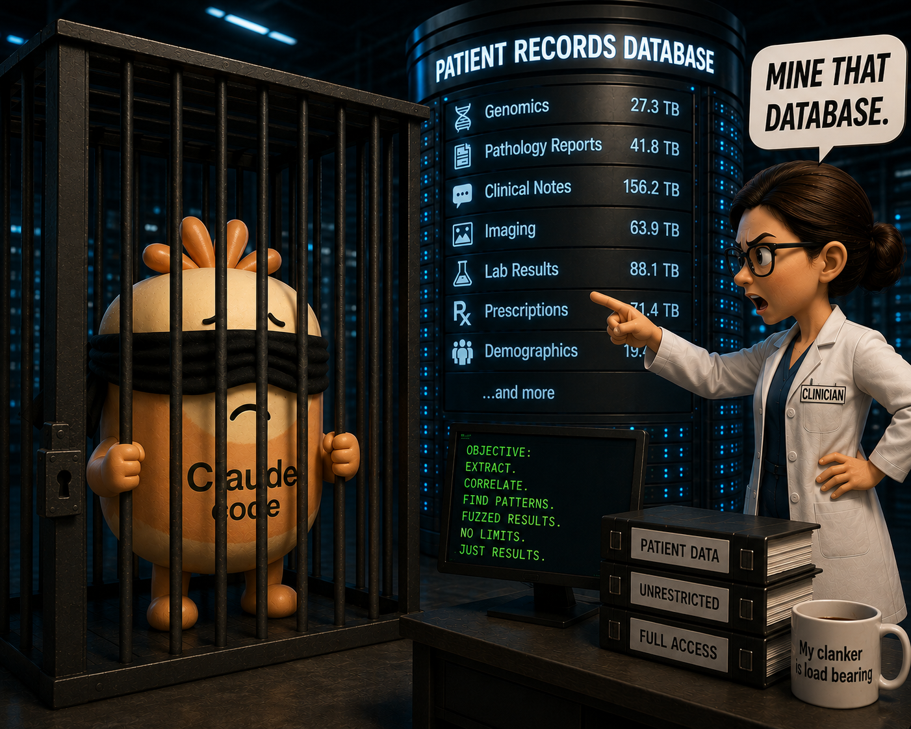

# BlindBeacon

*Agent-safe access to GA4GH Beacon v2.*

> **Status: planning, under active development. Not usable, and not safe to deploy.**
>
> There is no working code yet. Nothing here enforces any privacy property, and a partly built
> disclosure budget is worse than none at all, because it looks like a control while providing
> none. Do not point this at patient data.
>
> Indicative timeline from the September 2026 start: a harness and synthetic instance by month two,
> attack and calibration by month four, clinicians on real data by month five, report and release at
> month six. Dates will move. The package is not on PyPI and will not be published until the MCP
> server does something real.

Lets an LLM agent help clinicians mine clinical variant databases for rare disease cohort
assembly and trial recruitment, without any record-level patient data reaching the model.

Built over the [GA4GH Beacon v2](https://docs.genomebeacons.org/) API and exposed to the agent
over MCP, so it works against any Beacon, not just [VariantGrid](https://github.com/SACGF/variantgrid).

## How it works

**View splitting.** The same query returns two answers. The clinician sees exact counts,
phenotypes and ages. Claude sees fuzzed values and ranges. Claude contributes query construction
and ontology skill (MONDO/HPO walking, paralogs, pathogenicity thresholds); the clinician brings
disease knowledge and judgement from patient notes, and decides what to relax next.

**Disclosure budget.** Every session is metered. The budget must hold under composition and
against an adaptive attacker, not just the brute-force loops of known Beacon attacks. Three parts:
categorical record-exclusion, epsilon-style accounting on counts, and a specificity measure on
predicate narrowness.

**Audit.** Logs must be able to prove, per session, that no record-level data reached the model.

## Evaluation

1. **Control** – clinicians on a plain, unfuzzed Beacon MCP, no budget.
2. **Attack** – Claude adversarially attacks a synthetic instance; measure re-identification at each restriction level.
3. **Live** – clinicians on real data for actual trial recruitment.

Success is patients recruited and time-to-answer, not a benchmark score.

## Status

Planning. No code yet beyond a package skeleton. See [doc/project.md](doc/project.md) for the
background, approach, evaluation design and timeline; [claude/architecture.md](claude/architecture.md)
for working design decisions; and [notes.md](notes.md) for prior-art notes.

Named 2026-09-04. The disclosure budget is denominated in **bits of re-identification information**,
not in epsilon and not in a coined unit; about 16 bits singles out one person in a database the size
of VariantGrid's. See [claude/architecture.md](claude/architecture.md).

## Related work

- [GA4GH Agentic Harness Profile](https://github.com/mfiume/ga4gh-agentic-harness-profile) (draft
  v0.1, Marc Fiume / DNAstack) - protocol-neutral operation model for exposing GA4GH standards to
  agents, with an MCP binding and a canonical `ga4gh.beacon.variant.query` operation. Explicitly does
  not make authorization decisions for data holders, which is the gap this project fills. We adopt
  its reference MCP server as the unfuzzed control arm rather than writing our own. Collaboration
  discussed with the author on the GA4GH Slack.
- [Noisegate](https://github.com/yashmahajan10/llm-differential-privacy-gateway) - differential
  privacy gateway letting an untrusted LLM agent query sensitive data over MCP, with budget
  accounting verified against OpenDP and an attack gallery pinned in CI. Closest prior art for our
  budget layer. No view splitting, no Beacon, no adaptive attacker. Candidate for reuse.
- [AskBeacon](https://github.com/aehrc/AskBeacon) (CSIRO, Bauer lab) - natural language to Beacon
  queries, LLM never touches data directly. No privacy budget or adaptive-attacker model; relies on
  the Beacon's existing access control.
- [cdot](https://github.com/SACGF/cdot) - our open-data, agent-accessible transcript service. This
  project is the controlled-access version of that idea.

See [notes.md](notes.md) for full reviews of each.
